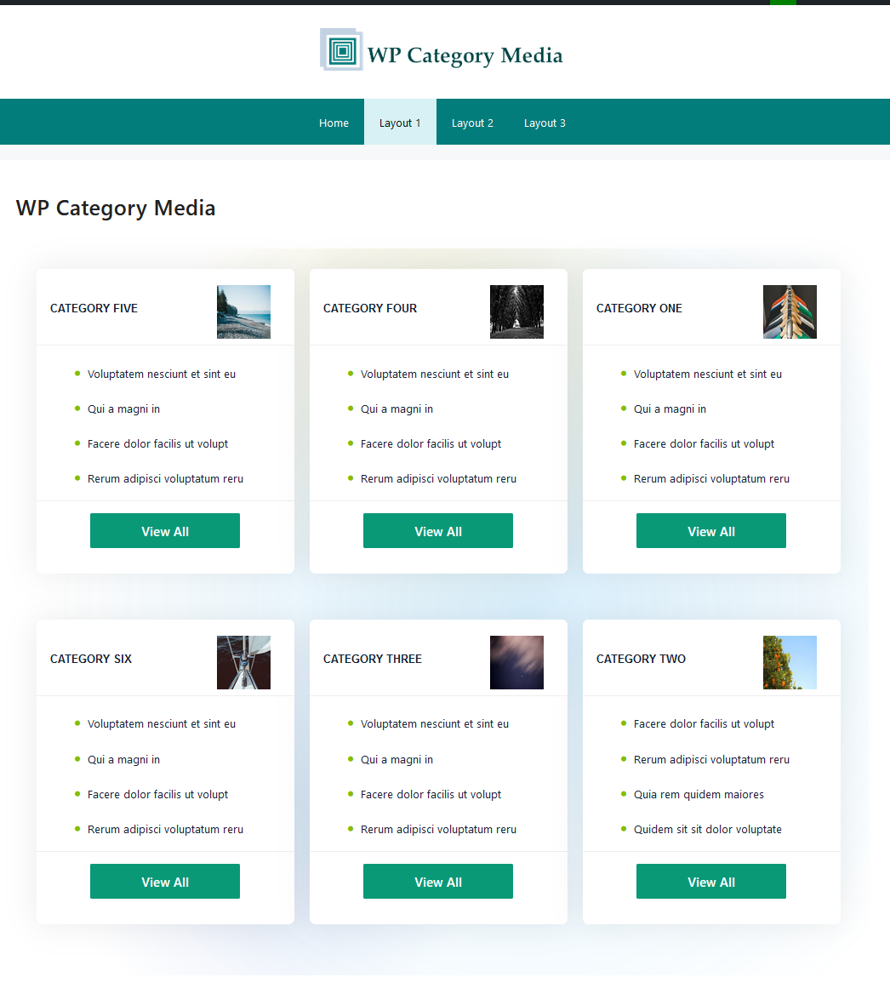
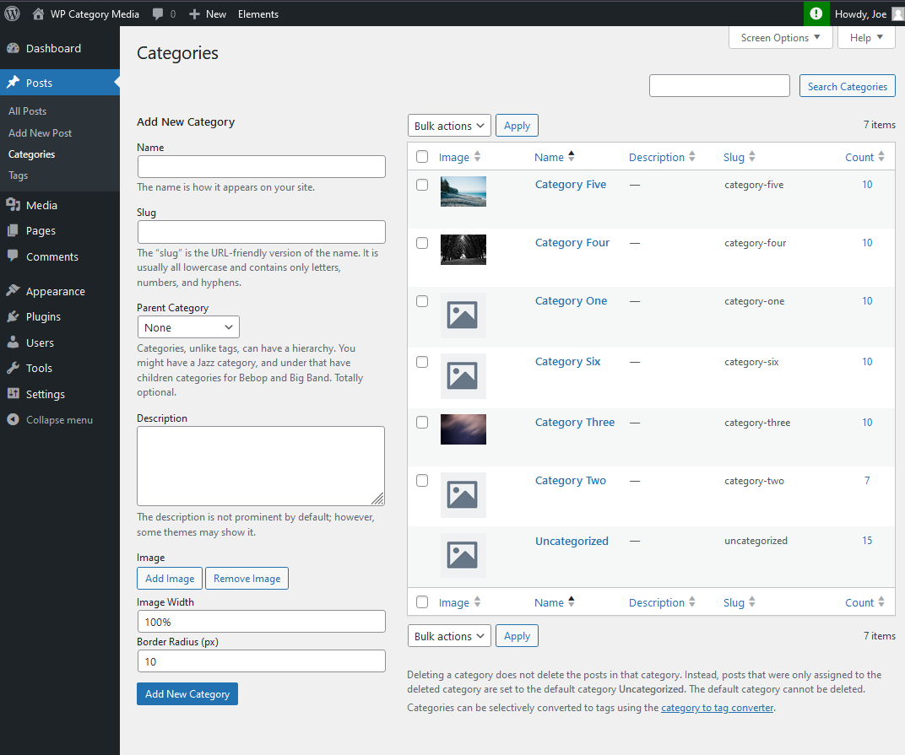
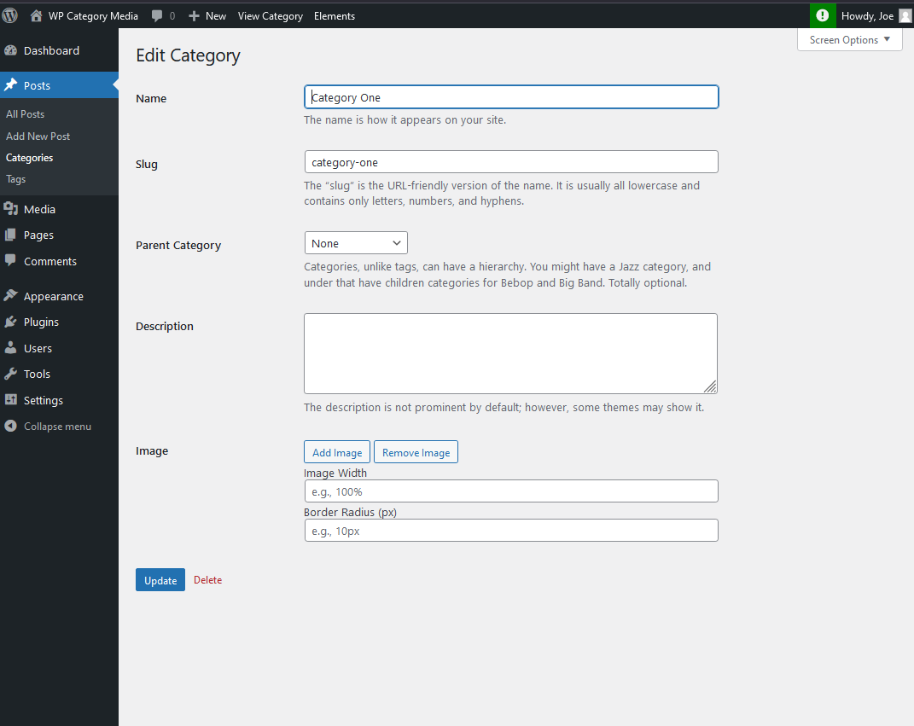
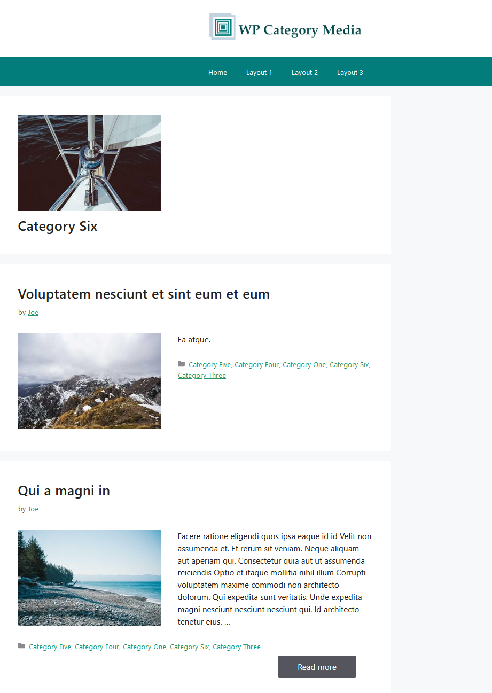

# WP Category Media

**WP Category Media** is a WordPress plugin that allows you to easily add and manage images for your categories. By associating images with categories, you can improve the visual appeal and usability of your site, making it easier for visitors to navigate and engage with content.

## Screenshots

### Multiple Category Display - Category Image

### Category List Page - Category Column

### Add Category Image - Category Image | Size | Border Radius

### Category Page Front - Category Image Display

## Features

- **Easy Category Image Upload:** Quickly upload and assign images to categories from the WordPress admin interface.
- **Seamless Integration:** Automatically integrates with your WordPress theme for a smooth user experience.
- **Customizable Display Options:** Set default or custom image sizes and alignment for category images.
- **Supports Media Library:** Select images directly from your WordPress media library for easy management.
- **Lightweight & Fast:** Optimized for performance, ensuring a minimal impact on your site’s load times.

## Installation

### 1. Install via WordPress Admin

1. Go to **Plugins > Add New** in your WordPress dashboard.
2. Search for "**WP Category Media**."
3. Click **Install Now** and then **Activate** the plugin.

### 2. Install via FTP

1. Download the plugin ZIP file from the GitHub repository.
2. Extract the ZIP file and upload the folder to the `/wp-content/plugins/` directory on your server.
3. Go to **Plugins > Installed Plugins** and click **Activate** next to **WP Category Media**.

## Usage

1. Once activated, go to **Posts > Categories** in your WordPress dashboard.
2. Select a category to edit or create a new category.
3. You will see a new option to upload an image for that category. Click **Add Image** and choose your image from the media library or upload a new one.
4. Save your changes, and the image will be displayed wherever categories are shown on your site.

## Customization

You can customize how category images are displayed by adjusting your theme's CSS or using built-in WordPress hooks to fit your needs.

## Contributing

1. Fork the repository.
2. Create a new branch (`git checkout -b feature/your-feature`).
3. Commit your changes (`git commit -am 'Add new feature'`).
4. Push to the branch (`git push origin feature/your-feature`).
5. Submit a pull request.

## License

This plugin is licensed under the **GPL License**.

## Support

For issues or questions, please open an issue on the [GitHub Issues Page](https://github.com/njengah/wp-category-media/issues).
